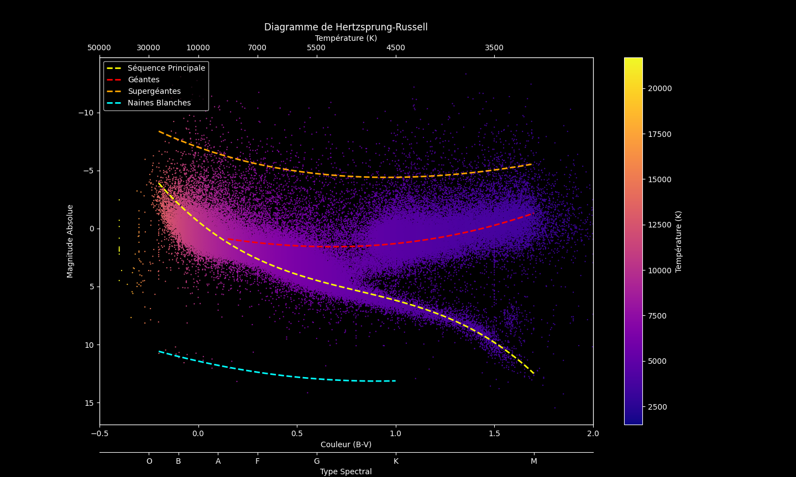

# Evolution-stellaire

## Description 
Ce projet modélise les différentes étapes de l'évolution stellaire en utilisant des outils théoriques et numériques. Il couvre l'évolution des étoiles de faible et de grande masse. Il inclut également une modélisation en Python du diagramme de Hertzsprung-Russell (HR) ainsi que de la carte de densité de ce diagramme. 

## Données
Les données utilisées pour créer les graphiques proviennent du satellite Hipparcos de l'Agence Spatiale Européenne (ESA).
Ces données sont accessibles via Kaggle à l'adresse suivante : [Hipparcos Star Catalog on Kaggle](https://www.kaggle.com/datasets/konivat/hipparcos-star-catalog/data).

## Exemples de résultats

## Licence 
Ce projet est sous licence MIT. Consultez le fichier [LICENCE](LICENCE) pour plus de détails sur les conditions de licence.

